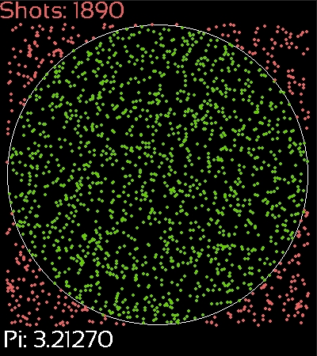

# Approximating Pi

Approximating Pi consists in randomly selecting points (x, y) from the interval [-R, R] and checking whether they are in a circle with radius R.
Our final result is:

```math
PI = (number of points in the circle * 4) / (number of points)
```


