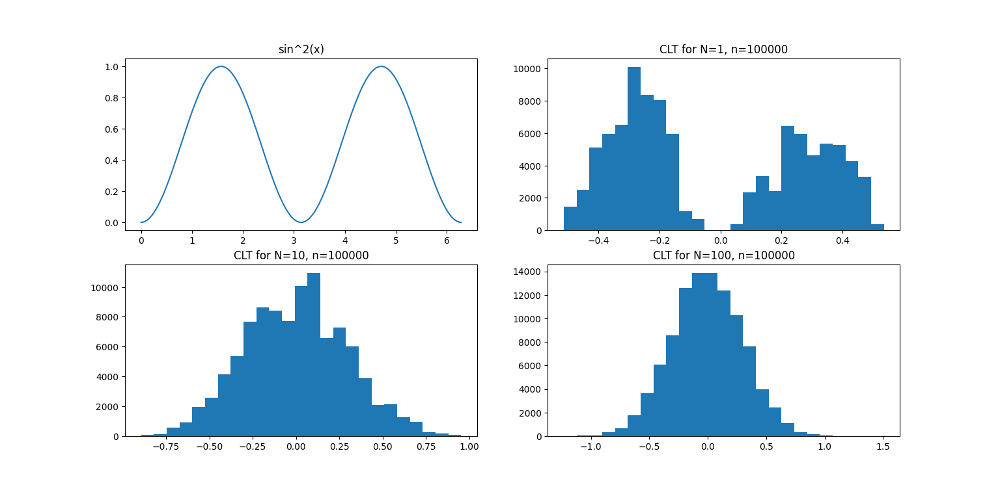

# Central limit theorem

In probability theory, the central limit theorem (CLT) establishes that, in many situations, when independent random variables are summed up, their properly normalized sum tends toward a normal distribution even if the original variables themselves are not normally distributed.



## Run program

Written in python using matplotlib and numpy.

```bash
python main.py
```
