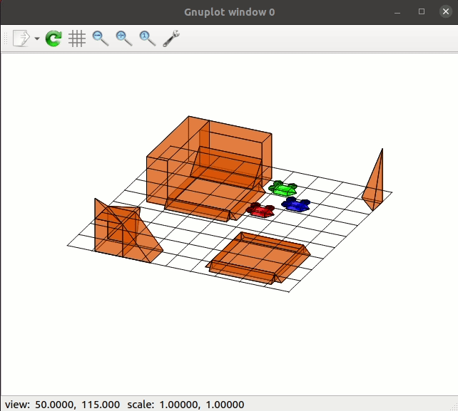

# Drones

Project made in college.



## Building

To build this project:

```bash
git submodule init
git submodule update
mkdir build && cd build
cmake ..
make
```

This should generate:

* Rotation3D_run - actual program
* Rotation3D_tst - testing program
* doc_doxygen - documentation of code

## Program

* Drones fly independently of each other (determine route of drone in another thread)
* Drones avoid obstacles and other drones in fly
* Drones can land on Cuboid class if there is enough space
* Drones cannot land on other obstacles and another drone
  