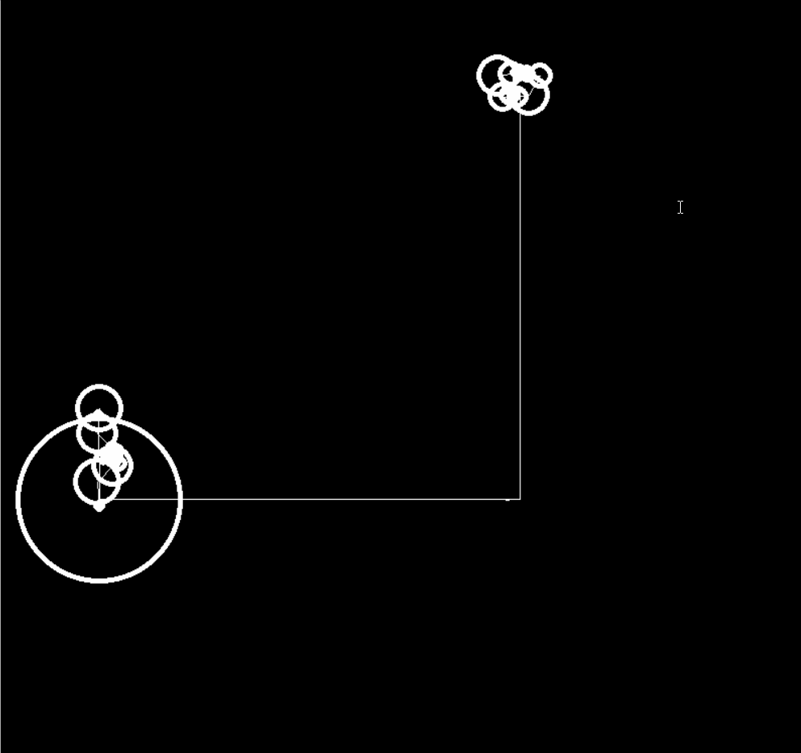

# Fourier Series



## How it's work

Uses [DFT (Discrete Fourier Transfrom)](https://en.wikipedia.org/wiki/Discrete_Fourier_transform) to decompose a function into the sum of trigonometric functions, which can be represented as spinning circles with the appropriate, frequency and phase.

## Setup

Project used pygame.

```bash
python3 -m pip install pygame
```

To open:

```bash
python3 main.py
```

## Link

[Code Train](https://www.youtube.com/watch?v=Mm2eYfj0SgA)
