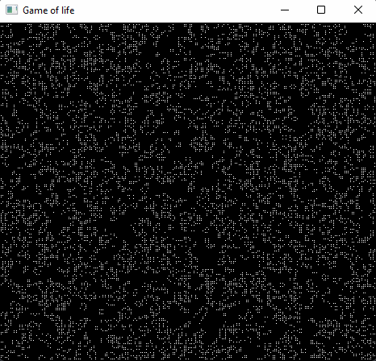

# Game of life

The Game of Life, is a cellular automaton devised by the British mathematician John Horton Conway in 1970.

## How it work

Initially, there is a grid with some cells which may be alive or dead. Our task to generate the next generation of cells based on the following rules:

* Any live cell with fewer than two live neighbors dies, as if caused by under population.
* Any live cell with two or three live neighbors lives on to the next generation.
* Any live cell with more than three live neighbors dies, as if by overpopulation.
* Any dead cell with exactly three live neighbors becomes a live cell, as if by reproduction.

## Links

[https://en.wikipedia.org/wiki/Conway%27s_Game_of_Life](https://en.wikipedia.org/wiki/Conway%27s_Game_of_Life)

[https://www.geeksforgeeks.org/program-for-conways-game-of-life/](https://www.geeksforgeeks.org/program-for-conways-game-of-life/)
