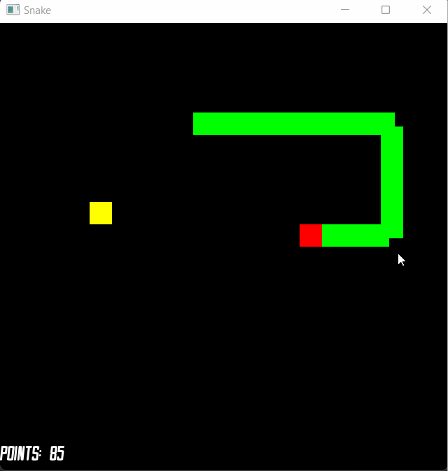

# Snake



## Setup

Project use a SFML library from git:

```bash
    git submodule update --init
```

To setup and run project:

```bash
    mkdir build && cd build
    cmake ..
    cmake --build .
```
